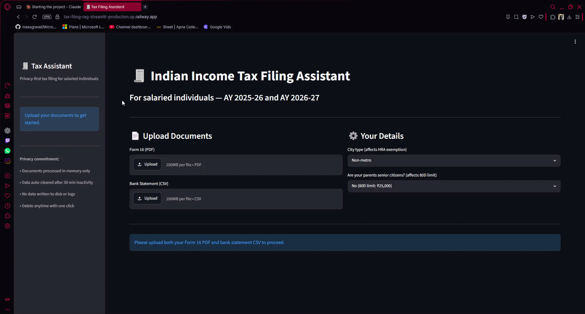

# 🧾 Tax Filing RAG Assistant

**A privacy-first RAG-based tax filing assistant for Indian salaried individuals**, built with an ephemeral, zero-persistence architecture aligned with India's DPDP Act.

🔗 **Live Demo:** [tax-filing-rag-streamlit-production.up.railway.app](https://tax-filing-rag-streamlit-production.up.railway.app)



---

# Why This Project Is Different

Most "chat with your documents" demos stop at retrieval-augmented generation. This one goes further by treating **data minimization as a first-class architectural constraint**, not an afterthought bolted on before deployment.

When a user uploads their Form 16 and bank statement:

- Documents are parsed **entirely in memory** — never written to disk
- Extracted financial data lives in a **per-session ephemeral ChromaDB collection** that is destroyed on session end or after 20 minutes of inactivity
- LangSmith traces are **redacted before leaving the process** — monetary values, PAN, and names never reach observability infrastructure
- A **"Delete My Data Now"** button gives users direct control, front and center in the UI

The result: a tool that reasons over sensitive financial data without ever persisting it.

---

# Verified Results

| Metric | Score |
| :--- | :---: |
| Extraction accuracy (Form 16 + bank statement) | **100%** (130/130 field checks, 10 personas) |
| Regime recommendation accuracy | **100%** (10/10 personas) |
| RAG answer faithfulness | **80.6%** |
| RAG answer relevance | **76.6%** |
| **Overall eval score** | **89.3%** |

All numbers are reproducible via the `evaluation/eval_harness.py` against 10 synthetic personas spanning salary brackets from ₹6L to ₹50L, covering metro/non-metro HRA, senior-citizen 80D limits, and surcharge edge cases.

---

# Architecture

```text
┌─────────────┐     ┌──────────────┐     ┌────────────────────┐
│  Streamlit  │────▶│   FastAPI    │────▶│  Extraction Layer   │
│     UI      │     │   Backend    │     │  (pdfplumber, CSV)  │
└─────────────┘     └──────┬───────┘     └──────────┬──────────┘
                           │                        │
                           ▼                        ▼
                  ┌──────────────────┐   ┌────────────────────────┐
                  │ Ephemeral Session │   │ Deterministic Tax Math │
                  │  ChromaDB (RAM)   │   │ (slabs, surcharge, cess)│
                  │  TTL: 30 min      │   └────────────────────────┘
                  └─────────┬──────────┘
                            │
                            ▼
                 ┌──────────────────────┐      ┌─────────────────────┐
                 │  Claude (Haiku)      │◀────▶│ Persistent ChromaDB │
                 │  Plain-language Q&A  │      │ (public tax law)    │
                 └──────────┬───────────┘      └─────────────────────┘
                            │
                            ▼
                 ┌──────────────────────┐
                 │  LangSmith Tracing   │
                 │  (financial values   │
                 │   redacted before send)│
                 └──────────────────────┘
```

**Core design principle:** the LLM explains and narrates — it never computes. All tax math (slab rates, surcharge, cess, Section 87A rebate, Rule 2A HRA exemption) is deterministic Python, validated against hand-calculated ground truth for every persona.

---

# Scope

Salaried individuals, resident status, old and new tax regimes, **AY 2025-26 and AY 2026-27** (year-agnostic architecture — new years added via config, no code changes).

### Covered

- Section 80C
- Section 80D
- HRA exemption (Section 10(13A) / Rule 2A)
- Standard Deduction
- old vs new regime comparison under Section 115BAC

### Explicitly out of scope

- capital gains
- business income
- NRI taxation
- 80E/80G/80CCD — kept tight so every covered path is genuinely eval-verified rather than superficially supported.

---

# Tech Stack

| Layer | Tools |
| :--- | :--- |
| Knowledge base | ChromaDB (persistent), sentence-transformers |
| Document parsing | pdfplumber, Pydantic |
| Privacy layer | ChromaDB EphemeralClient, TTL sweep, UUID sessions |
| Reasoning | Deterministic Python (tax math) + Claude Haiku (RAG Q&A) |
| Observability | LangSmith with custom redaction middleware |
| Backend | FastAPI |
| Frontend | Streamlit |
| Evaluation | Custom harness (extraction accuracy, regime accuracy, RAG faithfulness/relevance) |
| Deployment | Docker, Railway |

---

# Project Structure

```text
Tax-Filing-RAG/
├── .github/
├── app/                          # FastAPI + Streamlit (unchanged)
│   ├── routers/
│   ├── main.py
│   └── streamlit_app.py
├── core/                         # ← rename from scripts/
│   ├── extraction/               # document parsing
│   │   ├── extract_documents.py
│   │   └── schemas.py
│   ├── reasoning/                # tax math + RAG
│   │   ├── tax_calculator.py
│   │   ├── deduction_engine.py
│   │   └── rag_engine.py
│   ├── privacy/                  # session management
│   │   ├── session_manager.py
│   │   └── langsmith_tracer.py
│   └── knowledge_base/           # ingestion pipeline
│       ├── chunk_sources.py
│       ├── fetch_sources.py
│       └── ingest.py
├── data/                         # constants and config (unchanged)
├── evaluation/                   # eval harness (unchanged)
├── knowledge_base/               # ChromaDB persistent store (unchanged)
├── raw_sources/                  # source documents (unchanged)
├── synthetic_data/               # test fixtures (unchanged)
├── tests/                        # ← move test_*.py here
│   ├── test_extraction.py
│   ├── test_session.py
│   ├── test_rag_engine.py
│   └── test_tax_calculator.py
├── pipeline/                     # ← one-time data scripts
│   ├── generate_form16.py
│   ├── generate_bank_statements.py
│   └── retrieval_test.py
├── docs/
│   └── demo.gif
├── Dockerfile.api
├── Dockerfile.streamlit
├── docker-compose.yml
├── requirements.txt
├── DECISIONS.md
└── README.md
```

---

# Running Locally

```bash
git clone https://github.com/Pritish-23/Tax-Filing-RAG.git
cd Tax-Filing-RAG
pip install -r requirements.txt

# Add your keys to .env
echo "ANTHROPIC_API_KEY=your-key" >> .env
echo "LANGSMITH_API_KEY=your-key" >> .env
echo "LANGSMITH_PROJECT=tax-filing-rag" >> .env

# Or run everything with Docker
docker compose up
```

Visit `http://localhost:8501` for the UI, `http://localhost:8000/docs` for the API.

---

# Running the Evaluation Suite

```bash
python evaluation/eval_harness.py
```

Runs extraction accuracy, regime recommendation accuracy, and RAG quality checks across all 10 synthetic personas, then saves timestamped results to `evaluation/results/`.

---

# What I'd Build Next

- Section 80CCD(1B) (NPS) — most requested deduction outside current scope
- Marginal relief calculation for surcharge (currently uses flat rate)
- GitHub Actions CI running the eval suite on every PR
- Multi-turn conversation memory within a session

---

# Author

Built by [Pritish](https://github.com/Pritish-23) as a portfolio project exploring privacy-preserving RAG architecture for sensitive financial use cases.
